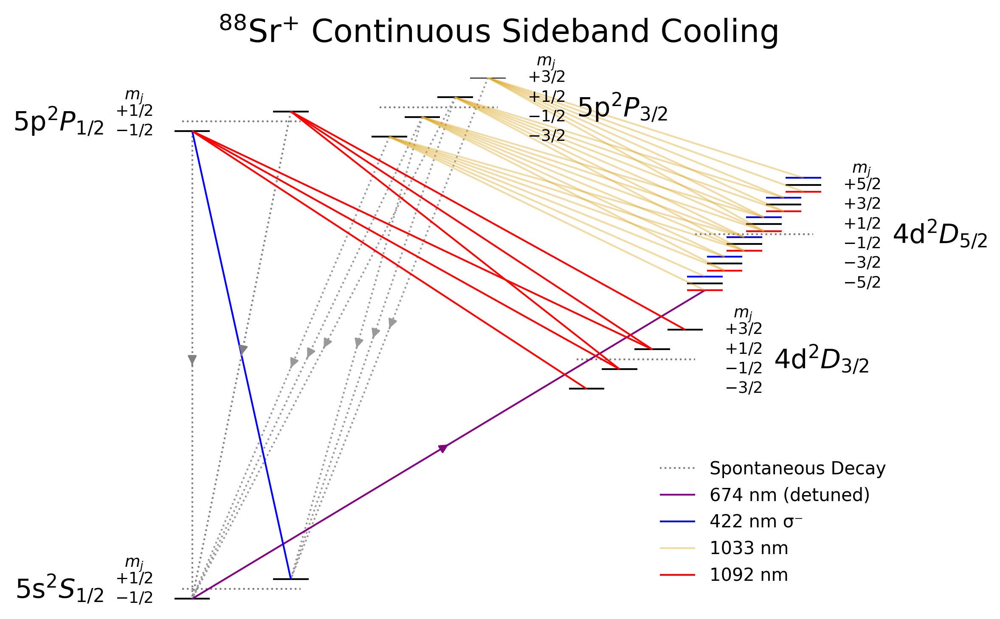
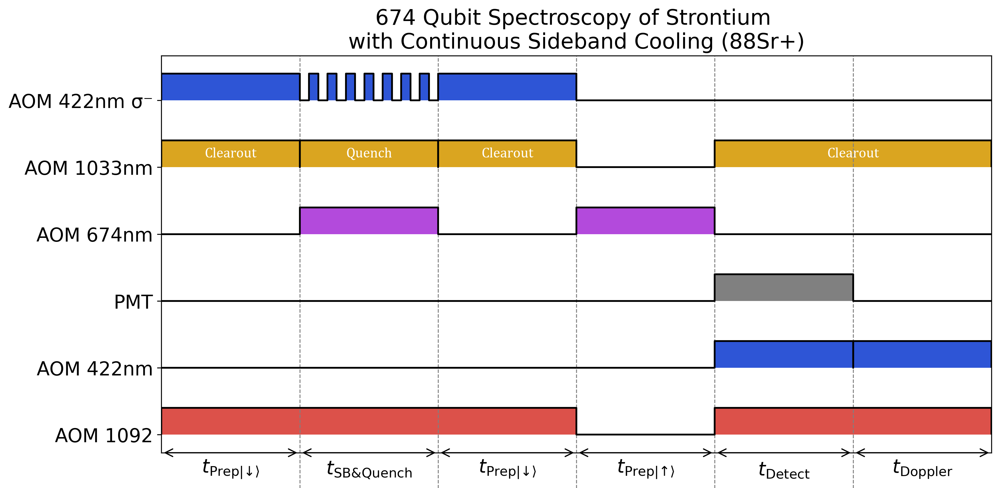

<!-- Hero logo (large, centered). The header still shows the small logo. -->

  

# IonVision

A compact toolkit from the **National Quantum Computing Centre (NQCC)** for
**describing and visualising trapped-ion experiments**.  
It turns a structured description of **ion levels, transitions, and control pulses**
into **publication-ready diagrams**.

---

## What you can do

- **Energy-level diagrams**  
  Shows the ion transitions involved in qubit encoding, repumping, cooling, readout, and more.

  

- **Pulse-sequence timelines**  
  Shows common pulse sequences used for qubit characterization, indicating the hardware and timings involved.

  

- **Reproducible, shareable outputs**  
  Quickly export high-quality PNGs or PDFs suitable for publications, presentations, and lab notes.

!!! tip "Who is this for?"

    Experimental ion-trap physicists writing reports, students learning about pulse sequences, and anyone who needs **clear, consistent diagrams** for trapped-ion control.

---

## Toolkit Architecture

Two small libraries power everything:

- **Energy Level Generator** (`energy_level_generator/`) — Set of tools to display energy levels neatly and add labels and arrows to show transitions between them.
- **Pulse Sequence Generator** (`pulse_sequence_generator/`) — Set of tools to display pulse sequence diagrams neatly and with configurable timings and apparatus control lanes.

In both cases, the diagrams are configured using a **simple JSON schema**.  

### Main Functions

The toolkit is primarily used by defining configurations in JSON files and calling **two main functions**:

| Function | Required Input | Optional Inputs | Output |
|----------|----------------|-----------------|---------|
| `generate_energy_diagram(data, style=None, save_path=None)` | JSON describing levels, sublevels, transitions | JSON for custom styling (colors, fonts), output file path | Static PNG energy-level diagram |
| `generate_pulse_sequence(data, style=None, save_path=None)` | JSON describing pulse timings, channels | JSON for custom styling, output file path | Static PNG pulse-sequence timeline |

### JSON File Formats

The two types of file are configured using simple JSON files.
These pages documents the structure, fields, and examples for each format:

- **[Energy Level Diagram - JSON Format](notebooks/energy_level_json.md)**  
- **[Pulse Sequence Diagram - JSON Format](notebooks/pulse_sequence_json.md)**  

## Learn by example

These pages contain two example Jupyter notebooks demonstrating how to use the package and the types of outputs it can produce.

- **[  $^{88}\mathrm{Sr}^{+}$ Energy Level Example](notebooks/energy_level_generator_Sr.ipynb)**
- **[  $^{88}\mathrm{Sr}^{+}$ Pulse Sequence Example](notebooks/pulse_sequence_generator_Sr.ipynb)**

## Where to go next

- **Getting Started** → [Installation](notebooks/01_quickstart.md)  
- **Examples** → See existing examples and use or learn from them.
- **Customizing Diagrams** → Learn how to make your own customized JSON files.
- **Why create this toolkit** → See the inspiration and intention behind this toolkit. 
- **API** → auto-generated docs from the code.

## Acknowledgements

Originally developed by Ian Irwan Ambak during a summer placement at the NQCC, with supervision and further development by Daisy Smith (Senior Ion‑Trap Physicist, NQCC).

<small>Source & issues: <https://github.com/ianalaman/IonVision></small>
